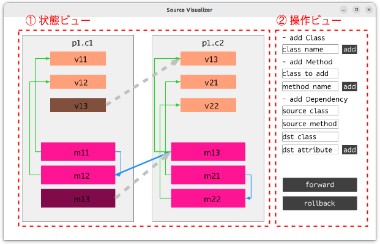
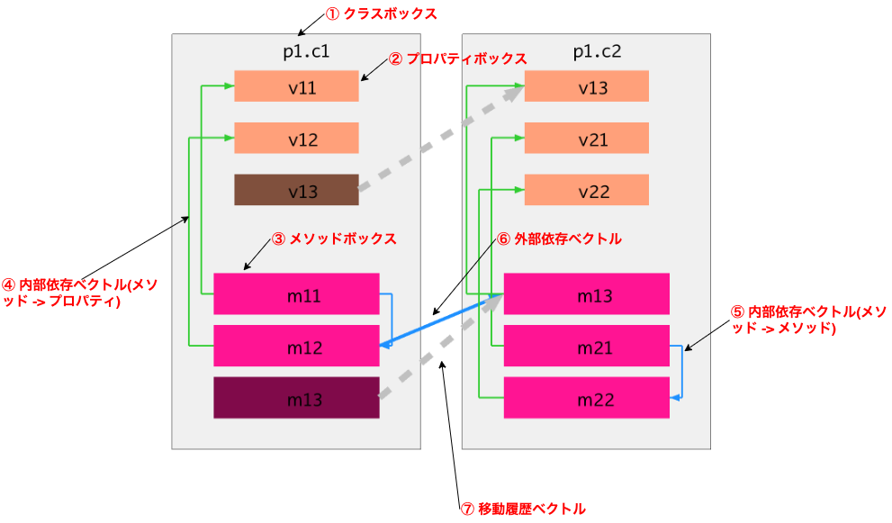
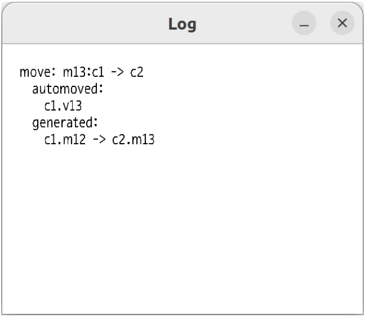

# SourceVisualizer
プログラムのアーキテクチャを変更する際、どういった変更を行うかを検討する際に使用する事ができる。

# 実行方法
## 実行環境
eclipseで実行することを前提としている。実行環境は以下。
- JavaSE-1.7(jdk-14)

## 準備
1. このリポジトリをクローンし、eclipseにGradle Projectとしてインポートする。
2. 適当なotfファイルをダウンロードし、 `path/to/otffile` と書かれている場所をダウンロードしてきたotfファイルへのパスに書き換える。

## 実行
desktop/src/com/sourcevisualizer/desktop/DesktopLauncher.javaをJava AppicationとしてRunする。

# 画面説明
【メイン画面(全体)】

① 状態ビュー
ソースコードの現在の状態を描画するビュー.

② 操作ビュー
要素の追加や, 操作を戻したり再実行を行うビュー.

【状態ビュー】

① クラスボックス
ソースコード内のクラスを表す. ボックスの上部には”{パッケージ名}:{クラス名}”の形式でクラス名が表示される.

② プロパティボックス
クラスの内部に存在するプロパティを表す. ボックスの内部にはプロパティ名が表示される.

③ メソッドボックス
クラスの内部に存在するメソッドを表す. ボックスの内部にはメソッド名が表示される. ドラッグアンドドロップにより他のクラスに移動することができる.

④ 内部依存ベクトル(メソッド -> プロパティ)
クラス内部でメソッドがプロパティに依存していることを示す.

⑤ 内部依存ベクトル(メソッド -> メソッド)
クラス内部でメソッドがメソッドに依存していることを示す.

⑥ 外部依存ベクトル
クラスをまたいで依存関係が存在していることを示す.

⑦ 移動履歴ベクトル
プロパティ, あるいはメソッドがユーザーの操作によりクラスをまたいで移動したことを示す. ここでいう移動はユーザーのドラッグアンドドロップ操作によるものの他, ツールによる依存関係解決の作用によるものも含む.

【操作ビュー】

① クラス追加ボタン
テキストボックスにクラス名をタイプし, add ボタンを押下することでパッケージに新たなクラスを追加する.

② メソッド追加ボタン
テキストボックスは上から順に ”メソッドを追加するクラス名”, “追加するメソッドの名前”を意味しており, これらをタイプし, add ボタンを押下することでクラスに新たなメソッドを追加する.

③ 依存関係追加ボタン
テキストボックスは上から順に ”依存元となるメソッドが属するクラス名”, “依存元となるメソッド名”, “依存先となるアトリビュート(プロパティあるいはメソッド)が属するクラス名”, “依存先となるアトリビュート(プロパティあるいはメソッド)名”を意味しており, これらをタイプし, add ボタンを押下することで新たな依存関係を追加する.

④ 進む・戻るボタン
状態をユーザーが操作を行う前の, 一つ前の状態に戻したり, 一つ先の状態に進めるボタン. forwardボタンを押下することで状態を一つ進めることができ, backwardボタンを押下することで状態を一つ戻すことができる.
状態を戻すには初期状態より最低でも一度は操作を行っていること, 状態を進めるには最低でも一度は状態を戻している必要がある.

【ログウィンドウ】

ログウィンドウには操作を行った履歴が表示される.履歴の種類は以下の通り.

① addC: (クラス名)
クラスを追加した履歴.

② addM: (メソッド名) to (クラス名)
メソッドを追加した履歴. クラス名にはメソッドを追加したクラスの名前が入る.

③ addD: (依存元クラス名).(メソッド名) to (依存先クラス名).(アトリビュート名)
依存関係を追加した履歴. 依存元クラス名には依存元となったメソッドが属するクラスの名前が, 依存先クラス名には依存先となったアトリビュートが属するクラス名が入る.

④ move: (メソッド名).(移動元クラス名) -> (移動先クラス名)
メソッドを移動させた履歴. moveログには移動に伴い自動的に実行された変更のログも記載される. 内容は以下の通り.

(1) automoved:
ユーザーの操作によって移動されたメソッドの依存関係解決により合わせて自動的に移動することになったアトリビュートが, (移動元クラス名).(アトリビュート名) の形式で記載される.

(2) generated:
移動に伴い新たに生成された外部依存関係が, (依存元クラス名).(メソッド名) -> (依存先クラス名).(アトリビュート名) の形式で記載される.
